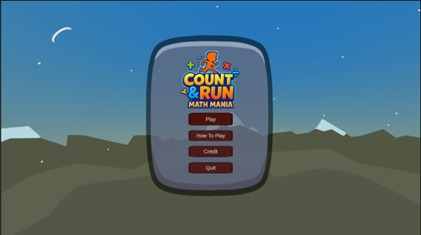

# Game-Unity-Count-Run-Math-Mania

Count Run: Math Mania adalah permainan edukasi berbasis Unity yang menggabungkan mekanika platformer dengan tantangan matematika. Pemain harus melewati rintangan, menjawab soal matematika, dan mencapai garis finish sambil menjaga nyawa. Proyek ini dibuat sebagai bagian dari proyek tim untuk mengembangkan keterampilan pemrograman, desain game, dan kolaborasi.

## Fitur Utama
- **Menu Utama Interaktif**:
  - Tombol Play, How to Play, Credit, dan Quit dengan animasi DOTween.
  - `CreditPanel` menampilkan nama anggota tim; klik nama untuk menampilkan foto di `PhotoPanel` (ditutup dengan tombol atau tombol Esc).
  - `LevelSelectPanel` untuk memilih level Easy (`Level`) atau Hard (`Hard`).
- **Gameplay**:
  - Scene `Level` dan `Hard` dengan mekanika platformer.
  - *Math Obstacle* ("Cube") di scene `Hard` menampilkan soal matematika (pembagian/akar kuadrat) via `MathObstacleHard.cs`.
  - Sistem nyawa (`LifeManager.cs`) dengan UI hati (`heartImages`) yang berkurang saat menjawab salah.
  - Garis finish (Z=430) untuk menyelesaikan level.
- **Sistem Skor**:
  - Scene `Score` menampilkan skor, akurasi, koin, dan hasil (Victory/Game Over) via `Scoreboard.cs`.
  - Animasi UI menggunakan DOTween untuk efek visual.
- **Manajemen Audio**:
  - Musik latar untuk `MainMenu` dan "GameOver".
  - Efek suara untuk klik tombol, hover, jawaban benar/salah (`AudioManager.cs`).
- **Transisi Scene**:
  - Menggunakan `LoadingSceneManager.cs` untuk memuat scene secara asinkronus.
  - Mendukung transisi dari `MainMenu` ke `Level`/`Hard` ke `Score`.
    
## Aset yang Digunakan
Berikut adalah aset pihak ketiga yang digunakan dalam pengembangan game ini:

- 🎯 [Pirate Coin by DavePixel](https://assetstore.unity.com/packages/3d/props/pirate-coin-207743) – Digunakan sebagai aset koin collectible.
- 🎓 [Unity Learn – Course Library](https://learn.unity.com/) – Referensi pembelajaran dalam pengembangan gameplay dan fitur.
- 🎞️ [DOTween (HOTween v2)](https://assetstore.unity.com/packages/tools/animation/dotween-hotween-v2-27676) – Untuk animasi transisi UI dan elemen game.
- 🏠 [Modular European House by Evgenia](https://assetstore.unity.com/packages/3d/environments/urban/modular-european-house-294289) – Digunakan sebagai bagian dari background lingkungan.
- 🕺 [Mixamo](https://www.mixamo.com/) – Digunakan untuk animasi karakter 3D.

